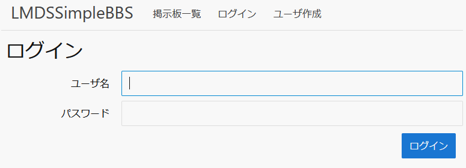
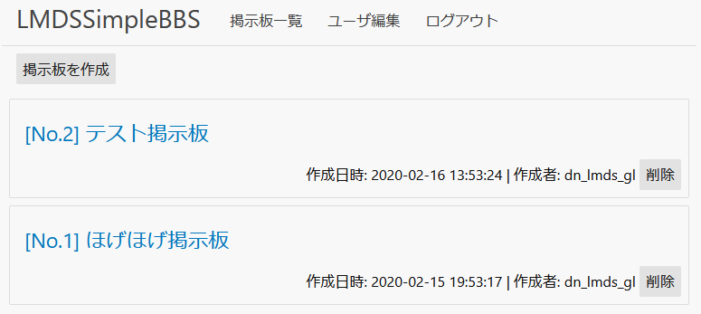
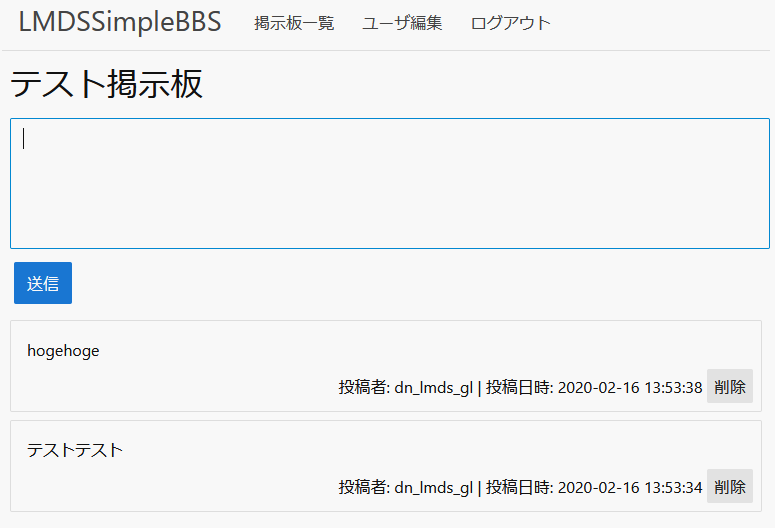
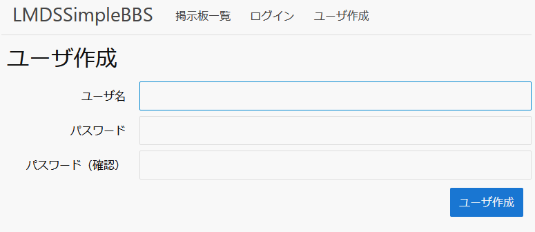
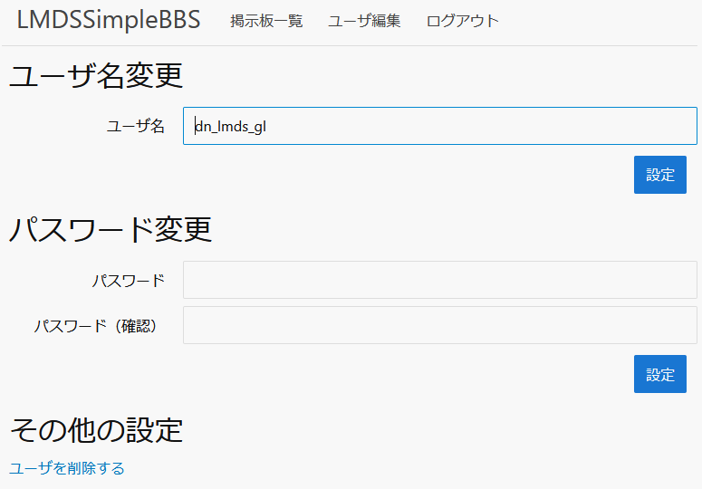

# lmdssimplebbs
とてもシンプルな掲示板システム

## Screenshots
### ログイン


### 掲示板リスト


### 掲示板


### ユーザ作成


### ユーザ編集


## 動かし方
1. コンテナを動かす
```
$ git clone https://github.com/lmdslyngl/bbs.git
$ cd bbs/container
$ docker-compose up
```

2. ブラウザでアクセス
```
http://{server-ip-addr}:8080/board
```
